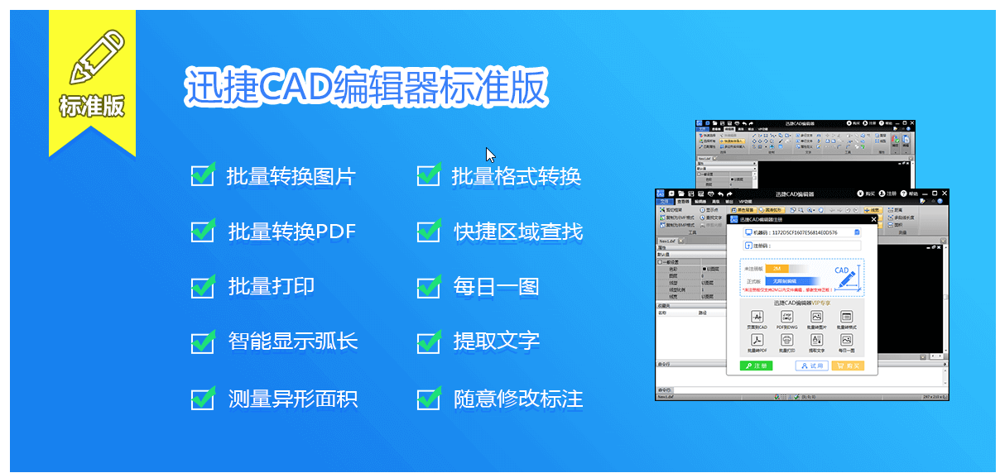
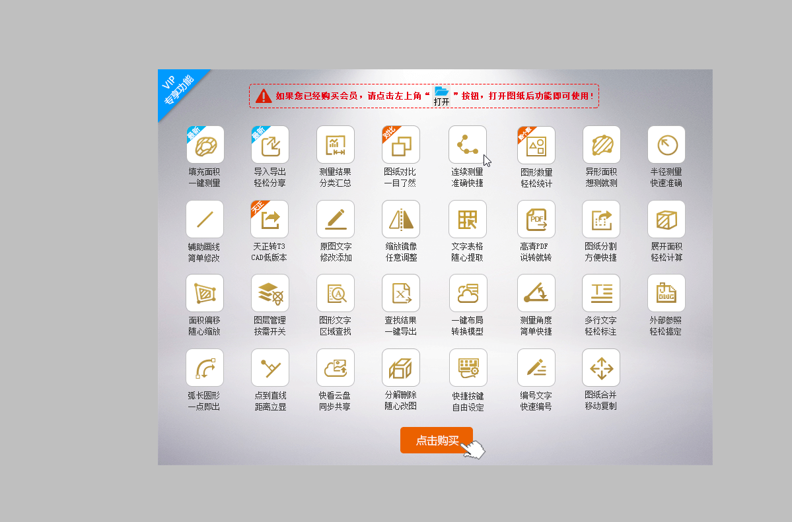
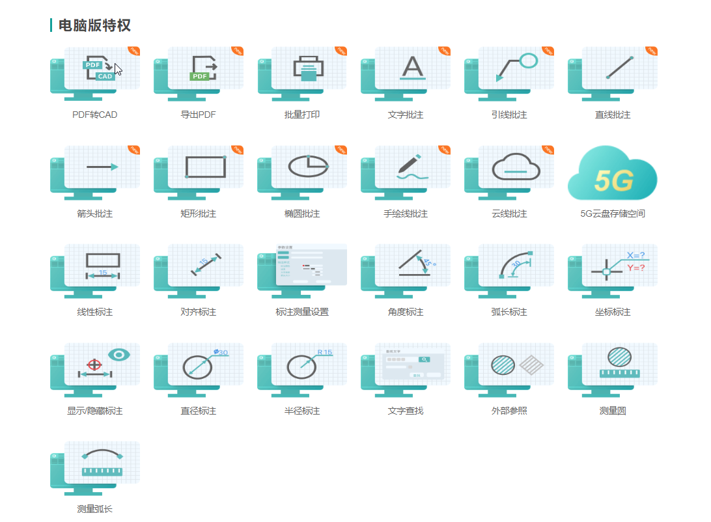

# CAD 竞品 商业模式调研

## 迅捷CAD免费版

#### 收费 无
#### 基础功能
- 看图  图层
- 编辑  基本线条 基本圆 基本文字 基本标注
- 转换 无
* * *
## 迅捷CAD标准版
#### 收费 
- **88**元买断
- **128** CAD标准版买断 + 一年CAD转换
- **156** CAD标准版买断 +  CAD转换买断
#### 基础功能
- 看图  2M以内文件 对象属性 图层
- 编辑  **多种**线条 **多种**圆  **多种**文字 **多种**标注
- 转换 附带CAD转换器入口
#### VIP特权

* * *
## 转转大师CAD编辑器
#### 收费 
- **36** CAD季度会员
- **48**  CAD年度
- **69**  CAD标准版买断 +  CAD转换买断

#### 基础功能
- 看图  非会员2M以内 对象属性 图层
- 编辑  **多种**线条 **多种**圆  **多种**文字 **多种**标注
- 转换 附带CAD转换器入口
#### VIP特权

### 特色功能
#### 1. 便宜，且编辑器内容和迅捷CAD标准版完全一样
* * *

## CAD快速看图
#### 收费 
- **42** CAD月会员
- **168**  CAD半年会员
- **170**  CAD年会员
#### 基础功能
- 看图  图层
- 编辑  
- 转换 附带CAD转换器入口
#### VIP特权

### 特色功能
#### 1. 云端同步
#### 2. 深入建工领域，有行业学习资料。
* * *

## 浩辰CAD
#### 收费 
- **18** CAD月会员
- **189** CAD年会员
#### 基础功能
- 看图  图层
- 编辑  基本线条 基本圆 基本文字 基本标注
- 转换 附带CAD转换器入口
#### VIP特权

### 特色功能
#### 1. 云端同步
#### 2. 跨平台